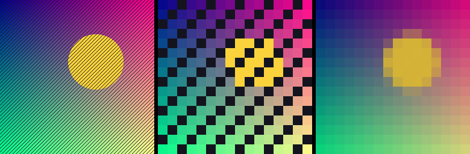

# True Pixelate

A Photoshop UXP plugin that pixelates the selected layer the way a real
downsize does — as if the layer had been resampled to 16, 32, 64, 128, 256,
512 or 1024 px with **nearest neighbour** and then blown straight back up. The
image is never actually resized.



Left to right: the source, True Pixelate at 16 px, and the same block grid
filled with each block's *average* colour — which is what Mosaic does. The
one-pixel diagonal stripes are the tell. Nearest-neighbour sampling keeps or
drops each stripe whole, so blocks come out as colours that genuinely exist in
the image. Averaging smears the stripes into flat grey and invents colours that
were never there.

## Why not just use Mosaic?

Mosaic averages every block, so the result is a smoothed, low-contrast version
of the image on a grid. A real nearest-neighbour downsize throws away all but
one pixel per block and keeps that pixel exactly. That difference matters when
you're after genuine pixel-art or retro-hardware output:

| | Mosaic / Pixelate filters | True Pixelate |
| --- | --- | --- |
| Block colour | mean of the block | one real source pixel |
| Palette | invents new colours | only colours already in the image |
| Fine detail | blurs to grey | aliases in or out, hard |
| Block grid | cell size in px | a target resolution (16 – 1024 px) |
| Output size | unchanged | unchanged |

Because each block's colour is copied from a pixel *inside* that block, the
result is idempotent: running 32 px twice is identical to running it once.

## Options

**Downsample to** — 16, 32, 64, 128, 256, 512 or 1024 px. This is the long
edge of the imaginary downsized image, not an output size. The short edge
follows the aspect ratio, exactly like Image Size with Constrain Proportions on.
At 32 px a 1920 × 1080 layer becomes 32 × 18 blocks of roughly 60 px each; at
512 px the same layer becomes 512 × 288 blocks of under 4 px each.

The larger presets only do something when the target is actually smaller than
what you point them at. Ask for 1024 px on an 800 px layer and the plugin says
so and leaves the layer alone, rather than upscaling it to nothing.

**Measured against**

- *Layer bounds* (default) — the layer's own pixel bounds are what gets
  downsized. A small layer gets small blocks. Use this when you want a
  particular layer to read as a 32 px sprite.
- *Canvas* — the document is what gets downsized, and the layer is pixelated on
  that grid. Block size is then identical for every layer in the document, so
  separately pixelated layers line up on the same grid. Use this when you're
  building a scene out of several layers.

**Work on a duplicate layer** (default on) — pixelates a copy named
`Layer [32px]` and leaves the original alone. Type, Smart Object and fill
layers are rasterized on the copy automatically, so the original stays
editable. With this off, the selected layer is edited in place and non-pixel
layers are refused rather than silently rasterized.

**Limit to active selection** (default on) — with a selection active, only the
selected area changes. Blocks stay aligned to the same grid as an unrestricted
run, so a selection reveals part of the full pixelation rather than pixelating
the selection as its own little image. Feathered and soft selection edges blend
correctly, including against transparency.

Each run is a single history step called *Pixelate 32 px*, so one undo reverts
it. Runs that would change nothing (a layer already at or below the target, a
selection that misses the layer) report why and leave the document untouched —
no stray duplicate layer, no empty undo step.

All seven sizes are also on the **Plugins** menu as *Pixelate to 16 px* and so
on, using whatever the panel's other options are currently set to. Those menu
items can be recorded into an Action if you want a keyboard shortcut.

## What's supported

Any bit depth (8, 16 and 32-bit) and any colour mode — pixels are copied as
whole tuples, so nothing is quantised or converted along the way. Pixel layers,
plus type / Smart Object / solid / gradient / pattern fill layers when
duplicating. Layers with transparency keep it exactly; alpha is copied, never
interpolated. Background layers (no alpha channel) work too.

Groups, adjustment layers, video and 3D layers are refused with a message
saying what to do instead. Layer masks, blend modes, opacity and layer styles
are left alone — only the layer's own pixels change.

## Install

Requires Photoshop 2026 (version 27.0) or newer on macOS or Windows 11.

### Development install (recommended while iterating)

1. Install the [UXP Developer Tool](https://developer.adobe.com/photoshop/uxp/2022/guides/devtool/) (UDT) from the Creative Cloud desktop app.
2. Launch Photoshop, then open UDT.
3. **Add Plugin…** and choose this repository's `manifest.json`.
4. Click **Load**. The panel appears under **Plugins › True Pixelate**.

`•••` › **Watch** in UDT reloads the panel whenever a file changes.

### Packaged install

In UDT, use the plugin's `•••` menu › **Package** to produce a `.ccx`, then
double-click it to install through Creative Cloud. A packaged `.ccx` has to be
signed to install on a machine without developer mode enabled; for personal use
the development install above is simpler.

Everything is plain JavaScript with no build step and no dependencies — there
is nothing to `npm install` before loading the plugin.

## If the panel looks dead

The hint line under *Measured against* is written by JavaScript, not by the
markup. If you can see that sentence, `main.js` loaded and the controls are
live; if the panel is blank there, script loading itself failed.

Failures are reported in the panel's own status line at the bottom, so most
problems explain themselves without a console. For anything else, open the
plugin's console from the UXP Developer Tool (the `•••` menu next to the
plugin, then **Debug**) and re-run — unexpected errors are logged there in full.


## Layout

| Path | What's in it |
| --- | --- |
| [manifest.json](manifest.json) | UXP manifest: panel plus four menu commands |
| [index.html](index.html), [styles.css](styles.css) | panel markup and styling — plain divs, no `sp-*` widgets |
| [main.js](main.js) | UI wiring, option state, status reporting |
| [pixelate.js](pixelate.js) | Photoshop integration: layer checks, Imaging API reads/writes, history |
| [plan.js](plan.js) | which rectangles to read and write, and block sizes |
| [nn.js](nn.js) | the nearest-neighbour resampling maths |
| [tools/preview.js](tools/preview.js) | renders `docs/preview.png` |
| [tools/make-icons.py](tools/make-icons.py) | regenerates the panel icons |

Every plugin module sits in the plugin root on purpose. UXP's `require()` is not
Node's, and it has not been consistent about whether a relative specifier is
relative to the requiring file or to the plugin root; with everything in one
directory both readings resolve to the same file.

[nn.js](nn.js) and [plan.js](plan.js) deliberately import nothing from
Photoshop, so the parts that are easy to get subtly wrong run under plain Node.
[main.js](main.js) holds the same line for the UI: nothing at its module scope
touches `photoshop` or `uxp`, so the panel always comes up interactive and has
somewhere to report a failure even if those modules fail to load.

## Tests

```sh
npm test          # 83 tests, no dependencies
npm run preview   # regenerate docs/preview.png
npm run icons     # regenerate icons/ (needs python3)
```

The suite runs the real plugin code against a fake `photoshop` module in
[test/fakes/](test/fakes/), so layer duplication, the Imaging API round trip,
selection blending and the panel's click handlers are all exercised outside
Photoshop — including the panel staying interactive when module loading or
entrypoint registration fails. The key check compares output against
[test/helpers/reference.js](test/helpers/reference.js), which does the naive
thing — allocate a small buffer, downsize into it, upsize back out — proving the
fused single-pass implementation is byte-identical to a true downsize/upsize
round trip at every preset.

One test reads [main.js](main.js), [index.html](index.html) and
[manifest.json](manifest.json) back as text and checks the size list matches
`SIZES` in [pixelate.js](pixelate.js). `main.js` deliberately keeps its own copy
of that list rather than importing it, so this guards the one place the four
copies could quietly drift apart.
